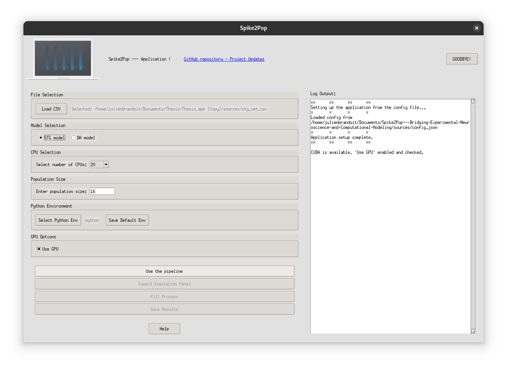
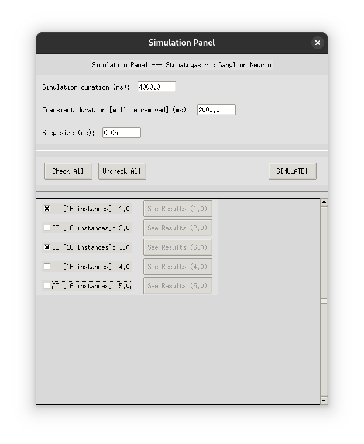
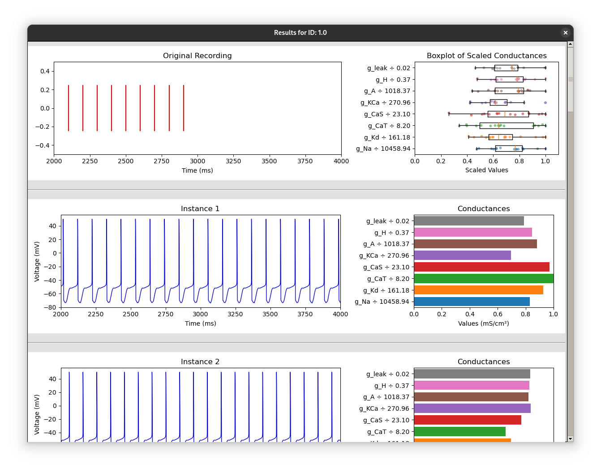

# Spike2Pop: Bridging Experimental Neuroscience and Computational Modeling

## Introduction

The human brain remains one of the most enigmatic and complex systems in nature. Understanding its mechanisms is fundamental to unraveling cognition, advancing treatments for neurological disorders, and driving innovation in artificial intelligence. However, one of the central challenges in neuroscience is decoding how diverse neural components interact to produce stable and adaptable behavior.

Neuronal degeneracy — the property whereby distinct, structurally or functionally diverse neural parameters produce similar activity — lies at the core of brain organization. This diversity enhances the brain robustness to developmental variability, injury, or disease by offering multiple pathways to perform essential functions.

## The Problem

Despite the potential of computational tools in neuroscience, experimentalists often face reluctance due to the complexity and technical expertise required to use these tools effectively. This gap between experimental observations and computational models limits the practical impact of computational neuroscience work and hinders scientific progress.

## Spike2Pop: The Solution

Spike2Pop is an open-source application designed to bridge this gap by providing a user-friendly interface for generating populations of degenerate conductance-based models (CBMs) from neuronal spike time recordings. This tool is developed to facilitate the integration of computational neuroscience tools into experimental workflows, making it easier for experimentalists to work with and validate these models.

### Key Features

- **User-Friendly Interface**: Designed for experimentalists without requiring technical expertise in coding or deep learning.
- **Fast and Scalable**: Efficiently generates populations of degenerate CBMs, making it suitable for large-scale applications.
- **Compatibility**: Conductance values can be used in various simulators or through the codes developed for this thesis.
- **Hardware Utilization**: Automatically detects and utilizes available hardware resources, including multiple CPUs and GPUs.
- **Model Support**: Currently supports Stomatogastric Ganglion (STG) neuron and Dopaminergic (DA) neuron models, with potential for expansion to other neuron models.
- **Simulation and Visualization**: Simulate the generated populations and visualize the results directly within the application.

### How It Works

1. **Input**: Provide a CSV file with spike time sequences recorded in the laboratory, each associated with an ID. The format for the spike time sequences should be `"[3045.0, ..., 4444.0]"` (a string with double quotes, square brackets, and comma-separated values). You can take a look at the [example CSV file](sources/stg_set.csv) in the source folder.
2. **Processing**: With a few clicks on the graphical interface, generate populations of the desired size.
3. **Simulation**: Simulate the generated populations and visualize the results.
4. **Output**: Obtain and save a CSV file containing all the generated populations associated with the original ID.


The main interface of the application is designed to be intuitive and user-friendly, allowing users to easily navigate through the different functionalities. Below is a screenshot of the main interface:


### Getting Started

To get started with Spike2Pop, follow these steps:

#### Option 1: Running from Source

1. **Installation**: Clone the repository. The requirements and detailed instructions will be released later.
   ```bash
   git clone https://github.com/julienbrandoit/Spike2Pop.git
   cd Spike2Pop
   ```

2. **Run the Application**:
   ```bash
   python spike2pop.py
   ```

#### Option 2: Using the Standalone Executable

1. **Download the Executable**: Download the entire `zip` folder from the [releases page](releases/README.md).

2. **Run the Executable**:
   - Currently, the standalone executable is available only for Linux. Open a terminal, navigate to the `application` directory, and run:
     ```bash
     ./Spike2Pop
     ```
   - Support for Windows and macOS will be available in future updates.

### Configuration

The application is designed to be flexible and extensible, allowing for the inclusion of custom models and configurations. This enables users to adapt the tool to their specific needs and experimental setups. Detailed instructions and guidelines for adding custom models and configurations will be provided in future updates.

## Simulation and Visualization

### Simulation Panel

Once you have generated the population, you can proceed to the simulation panel:

1. **Open Simulation Panel**: Click 'Toward Simulation Panel' to open the simulation panel.
2. **Set Simulation Parameters**: Set the simulation duration and step size.
3. **Select IDs**: Select the IDs you want to simulate by checking the corresponding checkboxes.
4. **Simulate**: Click 'SIMULATE!' to start the simulation.
5. **View Results**: After the simulation is complete, you can view the results by clicking 'See Results' for each ID. The trace values are stored along the conductance values for the simulated instances.

Below is a screenshot of the simulation panel:


### Visualization

The visualization feature allows you to view the simulation results in a graphical format. Once the simulations are complete, you can view the results by clicking on the 'See Results' button for each ID. This will open a new window displaying the simulated voltage traces, the original spiking times and the conductance values and distribution for the selected ID.


## About the Project

This application was developed as part of my **Master's Thesis** during my Master of Science in Biomedical Engineering. It represents my first full software project, aimed at making computational tools more accessible to experimental neuroscientists. Once published, you will be able to access the full thesis here: **[link to be added once released]**.

As this is my first time building and releasing an application, **feedback is very welcome** — whether it's about usability, features, bugs, or suggestions for improvement.


## Contact

For questions, feedback, or collaboration inquiries, feel free to contact me:

**BRANDOIT Julien**  
📧 [julienbrandoit@gmail.com](mailto:julienbrandoit@gmail.com)

## Licensing

This project is licensed under the **MIT License**, a permissive open-source license that allows anyone to use, copy, modify, merge, publish, distribute, sublicense, and/or sell copies of the software, as long as the original license is included with it.

This license encourages wide adoption and contribution while keeping things simple and developer-friendly. It also explicitly states that the software is provided "as is", without warranty of any kind.

You can find the full license text in the [LICENSE](./LICENSE) file at the root of the repository.

> Licensed under the MIT License. See the LICENSE file for details.